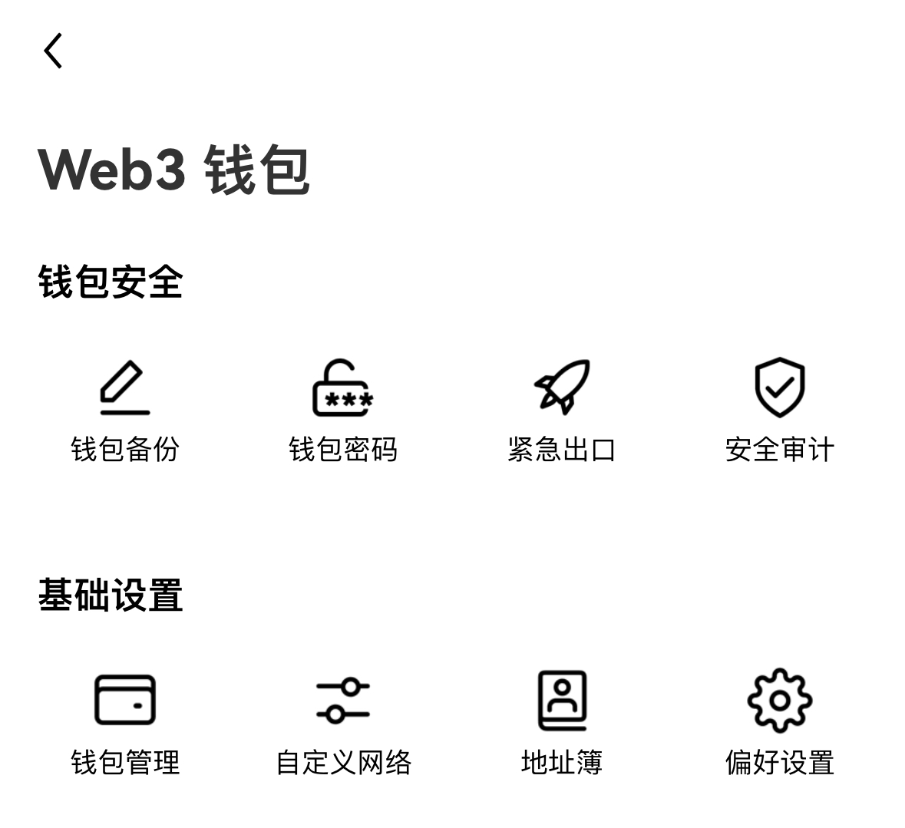
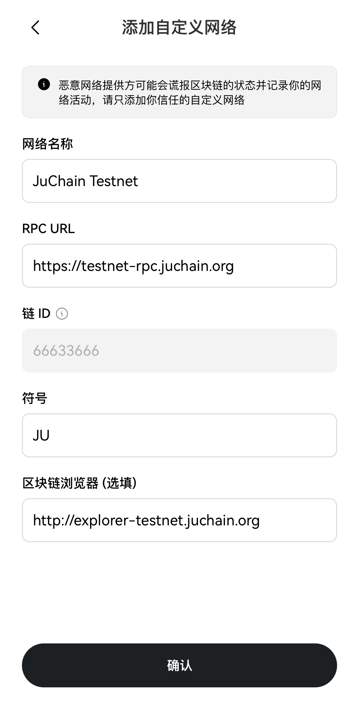

# 开始使用 JuChain

## 在您的 MetaMask 钱包中使用 JuChain 测试网络

### 第一步：安装 MetaMask 钱包

1. 打开 PC（个人电脑） 端的 Chrome 浏览器，访问 Chrome 网上应用商店&#x20;
2. 搜索"MetaMask"，选择官方版本安装
3. 点击"获取"进行安装
4. 安装完成后，浏览器右上角会出现 MetaMask 的狐狸图标
5. 首次使用需要创建钱包，请妥善保管助记词

<figure><figcaption></figcaption></figure>

### 第二步：添加 JuChain 测试网络

1. 点击 MetaMask 左上角的网络选择下拉菜单
2. 点击"添加自定义网络"
3.  填写以下网络信息后点击保存即添加成功：

    * 网络名称：JuChain Testnet
    * RPC URL：https://testnet-rpc.juchain.org
    * 链 ID：66633666
    * 货币符号：JU
    * 区块浏览器：http://explorer-testnet.juchain.org/

4. JuChain 也提供了自动添加网络至 MetaMask 钱包的方案，即访问 JuChain 测试网官网 testnet.juchain.org，点击“添加网络” 即可添加完成。

<figure><figcaption>
Network Info
</figcaption></figure>

### 第三步：获取测试币

1. 访问水龙头网站：http://faucet-testnet.juchain.org/
2. 复制你的 MetaMask 钱包地址（0x..）\
   
3. 将你的钱包地址粘贴到输入框中
4. 点击"获取测试币"按钮
5. 等待几秒钟，测试币将自动发送到你的钱包

<figure><figcaption></figcaption></figure>

### 常见问题

1. 如果添加网络失败，请检查：
   * 网络参数是否填写正确
   * 网络连接是否正常
   * MetaMask 是否是最新版本
2. 如果无法获取测试币：
   * 确保钱包地址复制正确
   * 每个地址每天有领取限额
   * 可以稍后再试
3. 如果看不到余额：
   * 确保已经切换到 JuChain Testnet 网络
   * 点击 MetaMask 的刷新按钮
   * 检查网络连接是否正常

### 注意事项

1. 这是测试网络，请勿在其中存储大量资产
2. 测试币仅用于测试目的，没有实际价值
3. 如遇到问题，可以通过社区寻求帮助

## OKX 手机端应用内 Web3 钱包添加 JuChain 测试网

1. 打开 OKX App，点击上方 "Web3 钱包"
2.

    <figure><figcaption></figcaption></figure>
3. 进入钱包页面，点击左上角进入钱包设置页面
4. 在“基础设置“里找到并选择"自定义网络"

<figure><figcaption></figcaption></figure>

4. 点击"添加网络"
5. 填写网络信息：
   * 网络名称：JuChain Testnet
   * RPC URL：https://testnet-rpc.juchain.org
   * 链 ID：66633666
   * 货币符号：JU
   * 区块浏览器：http://explorer-testnet.juchain.org/

<figure><figcaption>
自定义网络信息
</figcaption></figure>

7. 点击"确认"完成添加

### 获取测试币

1. 在钱包页面点击"接收"复制你的钱包地址
2. 打开浏览器访问水龙头网站：http://explorer-testnet.juchain.org/
3. 将复制的钱包地址粘贴到输入框
4. 点击"获取测试币"
5. 等待几秒钟后回到 OKX 钱包查看余额, 可点击“发送”在可选币种内看到JU的余额

