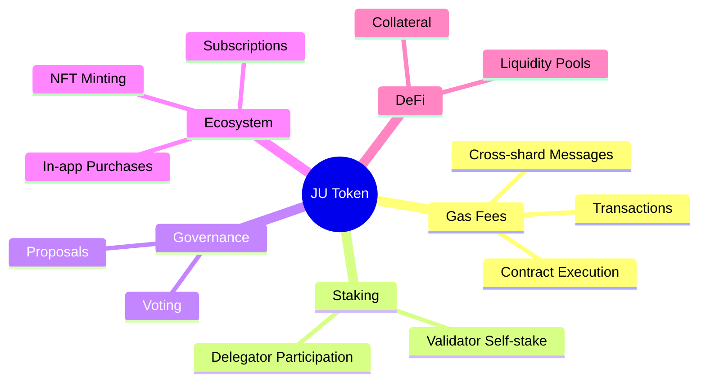

# Token Utility and Use Cases

Beyond its role in securing the network, the JU token is designed as a multi-purpose asset that underpins every layer of the JuChain ecosystem.

_Figure: JU Token Utility Map - Illustrating the multi-purpose nature of the token_

## Core Utility Functions

### Gas Fees

All on-chain transactions, contract executions, and cross-shard messages are paid in JU, creating constant demand that scales with network activity.

### Staking and Delegation

Validators must self-stake JU, and delegators bond JU to earn rewards, directly linking token value to network security.

### Governance

JU holders may propose and vote on protocol upgrades, parameter changes, and treasury grants under the on-chain governance module.

## Ecosystem Applications

### Ecosystem Payments

Dapps can denominate in-app purchases, NFT minting fees, and subscription models in JU—benefiting from low fees and instant finality.

### Collateral and DeFi

JU can be used as collateral for lending protocols and liquidity-pool provisioning once the JuChain DeFi stack launches.

### Cross-Chain Bridge Fees

Transfers between JuChain and external networks (e.g., Ethereum, BSC) incur bridge fees payable in JU, further expanding utility.

## Value Accrual Mechanisms

The JU token is designed to capture value from network growth and increased usage in several ways:

1. **Transaction Volume**: As more transactions occur on the network, more JU is needed to pay gas fees
2. **Staking Demand**: Higher validator and delegator participation locks up more tokens, reducing circulating supply
3. **Ecosystem Expansion**: As more applications build on JuChain, the utility and demand for JU increases
4. **Cross-Chain Activity**: Bridge fees create additional demand as the network becomes an interoperable hub
5. **Governance Value**: As the network grows, the value of governance rights increases, driving demand for JU

This multi-faceted utility ensures that JU token value is tightly coupled with the success and growth of JuChain as the ultimate chain traffic hub.
